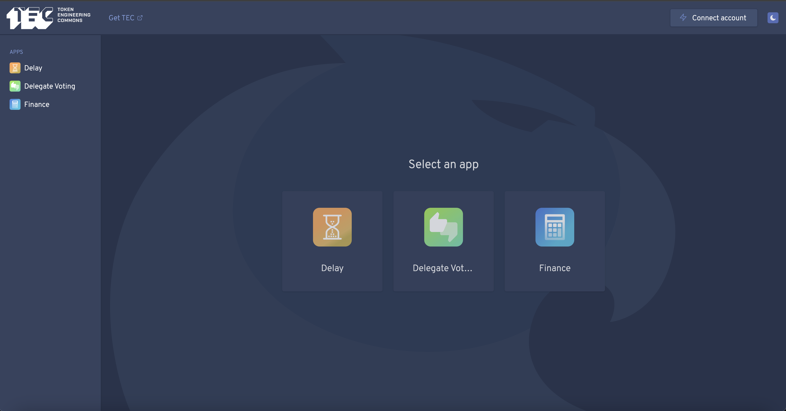

# Commons DAO [](https://github.com/commons-stack/commons-dao)

The web app for the Token Engineering Commons DAO.





## How to run locally

1. Git clone this repo.

```sh
git clone https://github.com/CommonsBuild/tec-dao.git
```

2. Go to directory.
```sh
cd tec-dao/
```
3. Install dependencies.

```sh
yarn
```

4. Set the environment variables.
5. Build the app.

```sh
yarn build
```

6. Serve the app.

```sh
npx serve dist
```

> NOTE: Take into account that the development server is using the hosted service of TheGraph, which is deprecated. On building the app the scripts/postinstall.sh script is used to replace the API key of TheGraph in the built files.

## Environment variables

Create a `.env` file with environment variables. You can use the `.env.example` file as a reference.

Below you can find a list of all the required variables:

| Env variable              | Description                                                                             |
| ------------------------- | --------------------------------------------------------------------------------------- |
| `CHAIN_ID`                | The ID of the chain where the DAO is located on.                                        |
| `DAO_ID`                  | The Aragon ID (ENS name) or address of the DAO.                                         |
| `GUARDIANS_TOKEN_MANAGER` | The address of the Guardian Token Manager app.                                          |
| `THEGRAPH_API_KEY`        | The API key for TheGraph.                                                               |

And here a list of optional variables:

| Env variable              | Description                                                                             |
| ------------------------- | --------------------------------------------------------------------------------------- |
| `ALCHEMY_API_KEY`         | The API key for Alchemy.com.                                                          |
| `INFURA_API_KEY`          | The API key for Infura.io.                                                              |
| `POCKET_API_KEY`          | The API key for Pokt.network.                                                           |
| `ANKR_API_KEY`            | The API key for Ankr.com.                                                               |
| `IPFS_RESOLVER`           | An URL similar to https://gateway.ipfs.io/ipfs/{cid}{path} with a custom IPFS gateway.  |
| `PORTALS_API_KEY`   | The API key for [portals.fi](http://portals.fi) (used for fetching the token prices and logos).                   |
| `BUDGET_APP_ADDRESSES`    | A list of comma-separated addresses of DAO apps that should be labeled as "Budget".     |
| `GOVERNANCE_APP_ADDRESSES`| A list of comma-separated addresses of DAO apps that should be labeled as "Governance". |

The optional API keys env variables are useful for setting different providers for request balancing in production environments.
